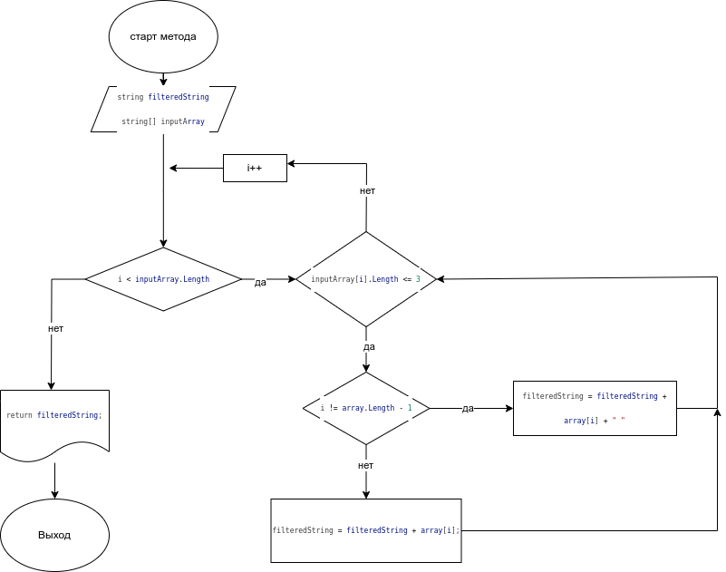

**Финальная работа**

_Задача: Написать программу, которая из имеющегося массива строк формирует новый массив из строк, длина которых меньше, либо равна 3 символам. Первоначальный массив можно ввести с клавиатуры, либо задать на старте выполнения алгоритма. При решении не рекомендуется пользоваться коллекциями, лучше обойтись исключительно массивами._

**В данном проекте 2 папки в которых содержится:**
1. Программа реализованная на языке C#
2. Блок-схема к программе

